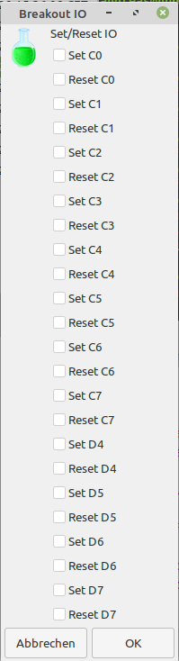

**WORK IN PROGRESS!**

# Breakout IO
These are some scripts to access the IOs of an FT232H FTDI Chip using Python and Bash.
Just quick and dirty!
Tested with the adafruit ft232h breakout board (if you have the same board check out https://github.com/andimoto/case_adafruit_ft232h for a 3d case model)
 

## Usage

- To set for example D6 Pin to high or low run following command
	- "python3 ft232hIO.py D6 out high" (set pin high)
	- "python3 ft232hIO.py D6 out low" (set pin low)
- It is also possible to edit the necessary pin in "pinHigh.py" or "pinLow.py" and run these scripts.
	- e.g. "python3 pinHigh.py" to set or "python3 readPin.py" to read a pin
- run ./BreakoutIO.sh to get a small (not well done) GUI (build up with yad) to set or reset one of the pins
	- yad is a simple cmd-line tool like zenity to generate some small gui dialogs - run "apt install yad" to get yad on ubuntu/debian machines
	- this script is just a dirty implementation to get a GUI fast. The yad window will close after selecting a operation and then it will pop up again due to the while loop in this bash script :D
	- to exit script type Ctrl-C in terminal where you started this bash script

 

 

 

# LICENSE

<dl>
 Dieses Werk ist lizenziert unter einer <a rel="license" href="http://creativecommons.org/licenses/by-sa/4.0/">Creative Commons Namensnennung - Weitergabe unter gleichen Bedingungen 4.0 International Lizenz</a>.
</dl>

<dl>
 This work is licensed under a <a rel="license" href="http://creativecommons.org/licenses/by-sa/4.0/">Creative Commons Attribution-ShareAlike 4.0 International License</a>.
</dl>
